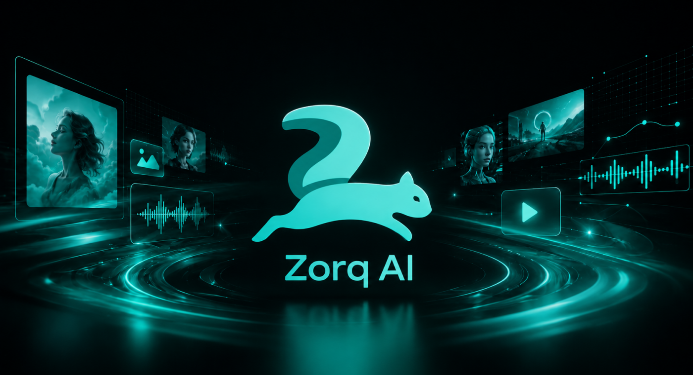

# Zorq AI

AI image and video generation platform for creating visual content from prompts, images, and related creative workflows.



<p align="left">
  <a href="https://zorcai.com/">
    
  </a>
  <a href="https://zorcai.com/resources/">
    
  </a>
  <a href="https://zorqai.com/">
    
  </a>
</p>

## Overview

**Zorq AI** is an AI creative tool for generating and editing images, videos, motion clips, lip sync videos, voice-based content, and other media workflows.

This repository is intended as a simple project overview and reference page for Zorq AI. For current product access, documentation, pricing, support, and usage details, use the website buttons above and the resource buttons below.

## Main Features

Zorq AI includes tools and workflows for:

- AI video generation
- AI image generation
- Text to video
- Image to video
- Cinematic video creation
- AI motion control
- Kling Motion Control
- AI lip sync generation
- Voice cloning workflows
- AI influencer content
- MultiGen image and video generation
- AI video models
- AI image models

Feature availability, model availability, credits, and usage limits may change. Always refer to the Zorq AI website for current details.

## How It Works

Zorq AI supports different creation paths depending on the user’s goal.

A typical workflow may look like this:

1. Choose the type of content you want to create.
2. Add a prompt, image, audio file, or reference input where required.
3. Select the tool or model that fits the task.
4. Generate the first result.
5. Review the output.
6. Refine the prompt, settings, or input.
7. Export or continue editing when available.

## Getting Started

Zorq AI is presented as an online AI tool platform. No local installation instructions are required for this README.

<p align="left">
  <a href="https://zorcai.com/">
    
  </a>
</p>

## Basic Usage Example

Example workflow for creating a short AI video:

```text
1. Open Zorq AI.
2. Choose a video generation workflow.
3. Write a clear prompt describing the scene.
4. Select the model or output settings.
5. Generate the video.
6. Review and refine the result.
```

Example prompt:

```text
A cinematic product shot of a black smartwatch on a reflective studio table, with a slow camera push-in, soft blue lighting, and a clean, modern commercial style.
```

## Official Resources

<p align="left">
  <a href="https://zorcai.com/">
    
  </a>
  <a href="https://zorcai.com/resources/">
    
  </a>
  <a href="https://zorqai.com/">
    
  </a>
  <a href="https://zorqai.com/">
    
  </a>
  <a href="https://zorqai.com/">
    
  </a>
  <a href="https://zorqai.com/">
    
  </a>
</p>

## Compatibility and Requirements

Zorq AI is an online AI tool platform. Requirements may depend on the tool being used.

General requirements may include:

- A modern web browser
- Internet connection
- Account, credits, or plan access where required
- Uploaded files that match the supported format and size limits
- Permission to use any image, video, audio, voice, logo, or reference material uploaded by the user

Check the Zorq AI website for current requirements and limits.

## FAQ

### What is Zorq AI?

Zorq AI is an AI image and video generation platform with tools for creating and editing visual content.

### Does Zorq AI support video generation?

Yes. Zorq AI includes AI video generation workflows, including text-to-video, image-to-video, cinematic video creation, and motion-related tools.

### Does Zorq AI support image generation?

Yes. Zorq AI includes AI image generation and image model workflows.

### Can Zorq AI create cinematic videos?

Zorq AI includes workflows related to cinematic video creation. Results depend on the prompt, input quality, selected model, and available settings.

### Can I use Zorq AI for image-to-video?

Yes. Zorq AI includes image-to-video workflows where users can start from an image and generate motion-based content.

### Can I use Zorq AI for voice cloning or lip sync?

Zorq AI includes voice-related and lip sync workflows. Users should only use voices, faces, images, and audio they have permission to use.

### Is Zorq AI free?

Free access, trials, credits, and paid plans may change. Check the Zorq AI website for current pricing and access details.

### Where can I report issues?

Use the support or contact path on the Zorq AI website.

<p align="left">
  <a href="https://zorqai.com/">
    
  </a>
</p>

## Contributing

This README is for project overview and reference purposes.

For contribution details, feature requests, issue reporting, or support questions, refer to the Zorq AI website.

<p align="left">
  <a href="https://zorqai.com/">
    
  </a>
</p>

## License

License details are not specified in this README.

For current license or usage information, refer to the Zorq AI website.

<p align="left">
  <a href="https://zorqai.com/">
    
  </a>
</p>

## Contact and Support

For support, documentation, product details, version information, or account-related questions, use the official Zorq AI support path.

<p align="left">
  <a href="https://zorqai.com/">
    
  </a>
</p>
